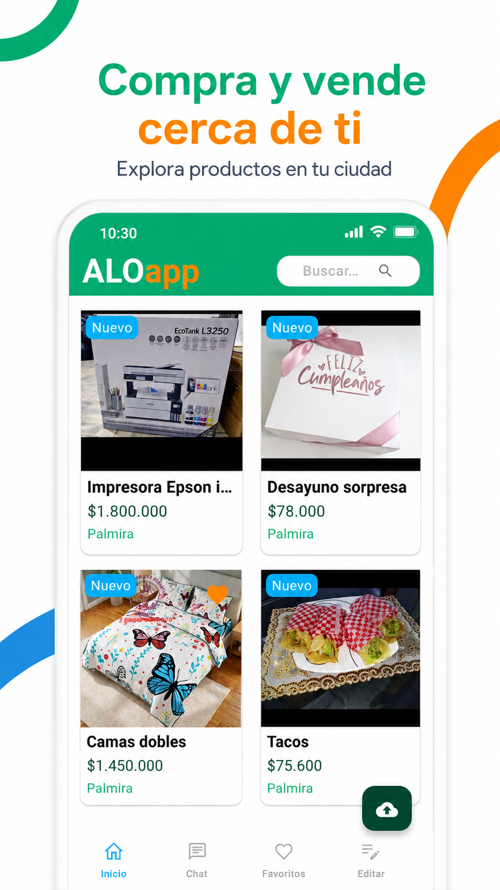
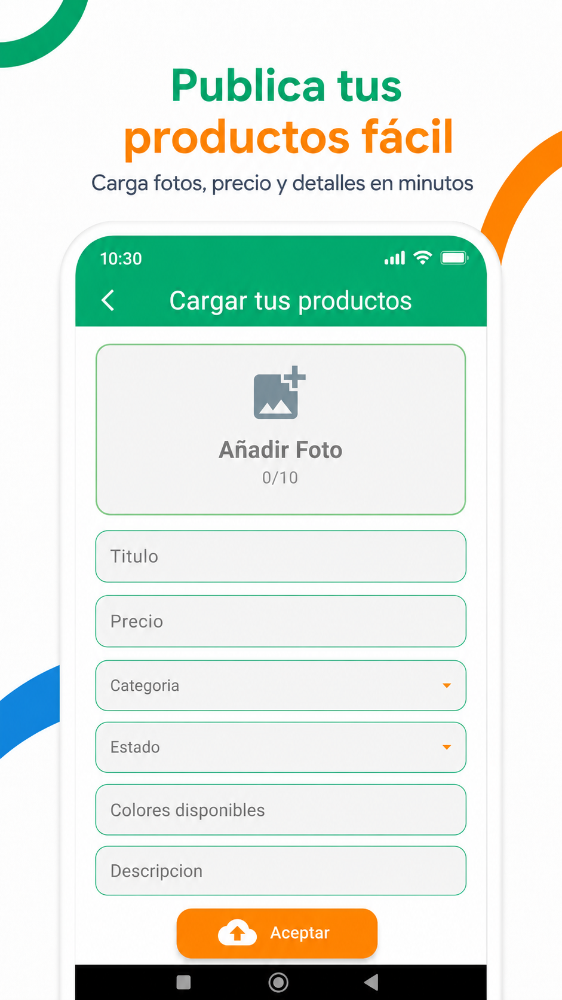
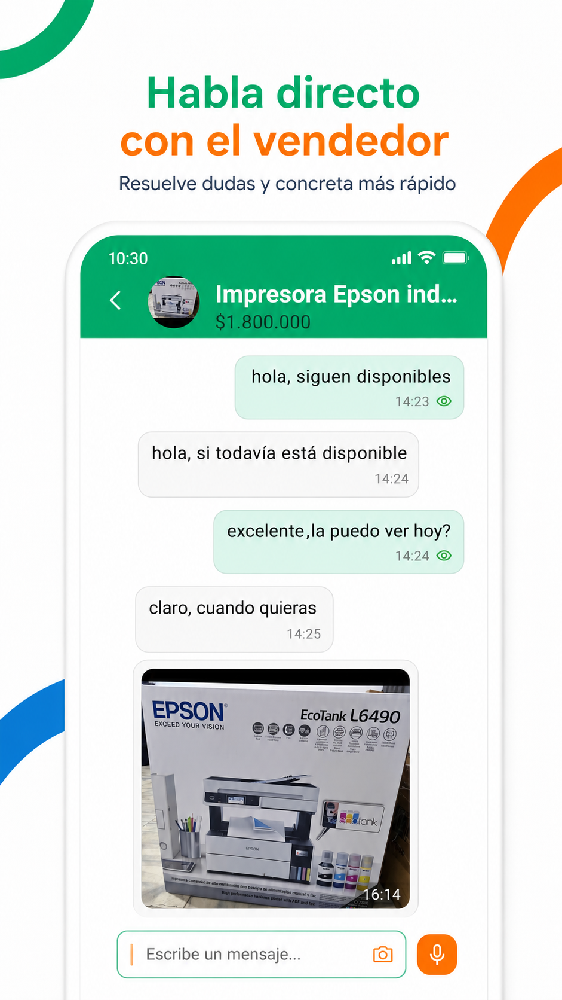
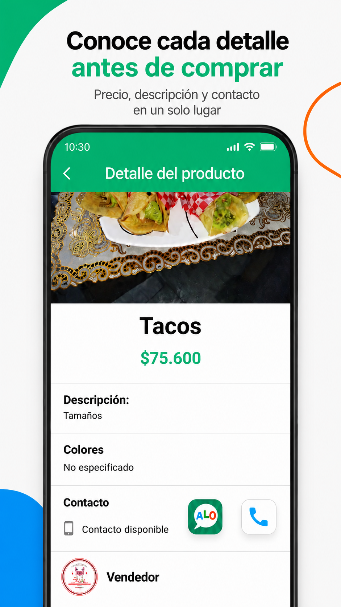
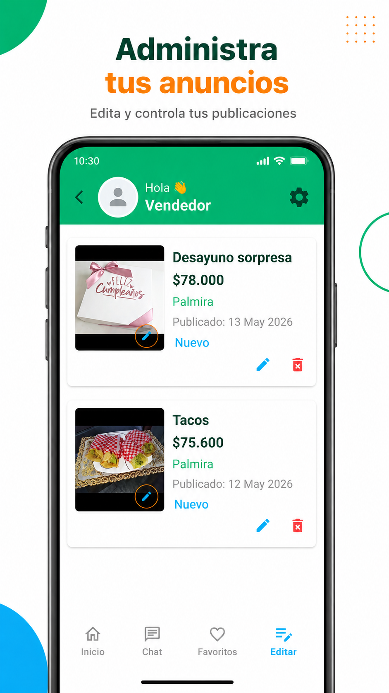
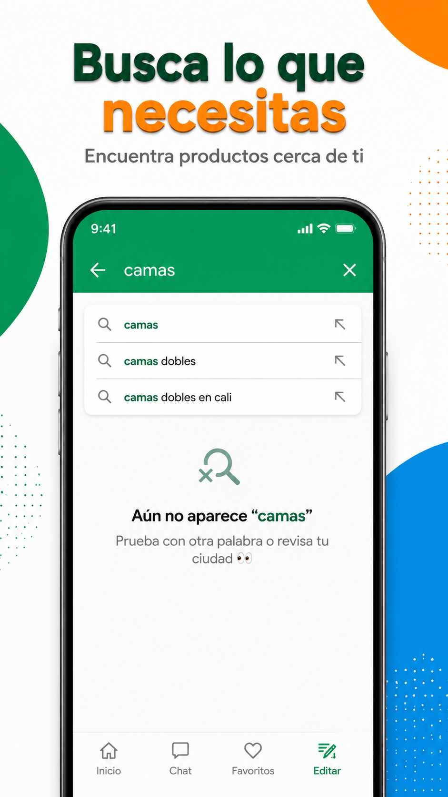
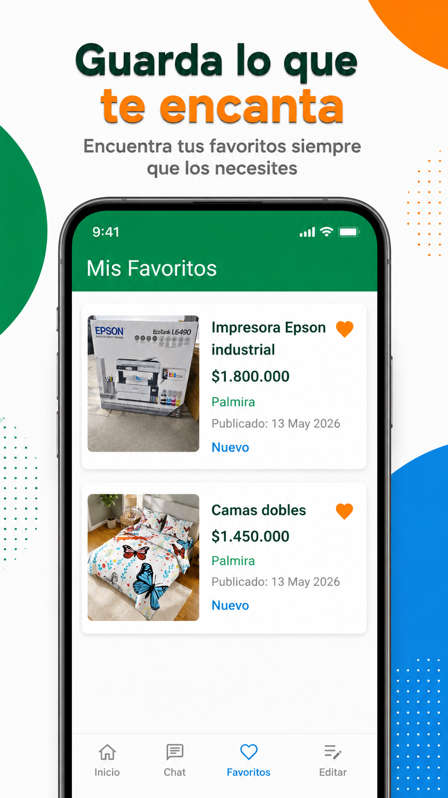

# ALOapp — Marketplace / Clasificados

ALOapp es una aplicación móvil tipo marketplace desarrollada con Flutter, Dart y Firebase. El proyecto está orientado a facilitar la publicación, búsqueda y negociación de productos entre usuarios desde dispositivos móviles.

> Este repositorio es una presentación del proyecto para portafolio. El código fuente completo se mantiene privado porque la aplicación está en proceso de publicación y validación comercial.

## Objetivo del proyecto

El objetivo de ALOapp es ofrecer una alternativa simple y rápida para que usuarios puedan publicar productos, explorar anuncios y comunicarse directamente con vendedores desde la aplicación.

## Tecnologías utilizadas

- Flutter
- Dart
- Firebase Authentication
- Cloud Firestore
- Firebase Storage
- Android
- Git / GitHub

## Funcionalidades principales

- Registro e inicio de sesión de usuarios.
- Publicación de productos.
- Carga y visualización de imágenes.
- Visualización de anuncios.
- Búsqueda de productos.
- Chat interno entre compradores y vendedores.
- Gestión básica de información de usuario.
- Flujo de publicación sencillo para vendedores.

## Estado del proyecto

La aplicación se encuentra en proceso de publicación. La solicitud de producción fue realizada en Google Play Console.

## Rol en el proyecto

Proyecto desarrollado de forma independiente como parte de mi portafolio profesional en desarrollo móvil. Participé en el diseño del flujo de usuario, implementación de pantallas, integración con Firebase, pruebas funcionales y preparación para publicación en Google Play.

## Aprendizajes principales

Durante el desarrollo de ALOapp fortalecí conocimientos en:

- Construcción de interfaces móviles con Flutter.
- Manejo de estado y navegación entre pantallas.
- Integración con Firebase.
- Modelado de datos en Firestore.
- Manejo de imágenes.
- Flujo de autenticación.
- Comunicación entre usuarios mediante chat.
- Pruebas funcionales en dispositivos Android.
- Proceso de preparación para publicación en Google Play.

## Próximas mejoras

- Optimización del buscador.
- Mejoras en la experiencia del chat.
- Sistema de publicaciones destacadas.
- Mejoras visuales en el perfil de usuario.
- Notificaciones push.
- Panel básico de administración.
- Métricas de uso y rendimiento.

## Capturas

### Vista 1

### Vista 2

### Vista 3

### Vista 4

### Vista 5

### Vista 6

### Vista 7

